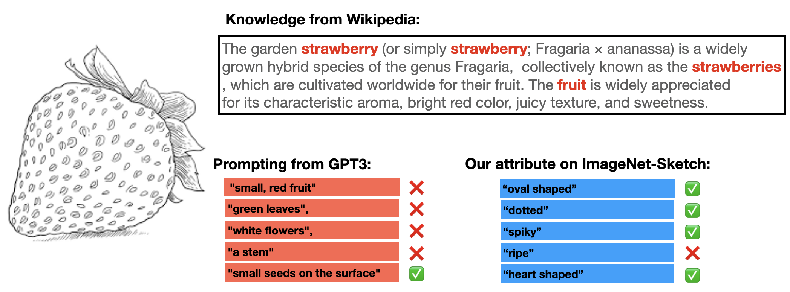

# Attributes Should Come from Images, Not Class Names

**Distribution-Conditioned Attribute Selection (AttributeSelect) for Vision-Language Models**

[](https://arxiv.org/abs/2607.18695)
[](https://github.com/ggare-cmu/AttributeSelect)
[](https://ggare-cmu.github.io/AttributeSelect/)
[](https://arxiv.org/abs/2607.18695)

Gautam Rajendrakumar Gare, Jia Shi, Zhiqiu Lin, Deepak Pathak, John Galeotti, Deva Ramanan
(Carnegie Mellon University)

LLM-generated class descriptors ride the class name: remove it from the prompt and
their ImageNet accuracy collapses from 59.5% to 15.5%. AttributeSelect selects attributes from
the **target image collection** instead: a frozen CLIP scores a large attribute pool
against the images, and each class keeps its top-ranked attributes. The selected
attributes stand on their own without class names, transfer under distribution
shift, beat prompt tuning (CoOp) in the extreme few-shot regime at a fraction of
the cost, and describe datasets and shifts in words.



## Key results

Class-name-free ("attribute only") zero-shot top-1 accuracy, CLIP-RN50, attributes
selected on ImageNet only and reused unchanged on the shifted variants:

| Prompt (no class name) | ImageNet | -V2 | -Sketch | -A | -R |
|---|---|---|---|---|---|
| LLM descriptors (Menon & Vondrick) | 15.50 | 14.00 | 9.60 | 8.57 | 17.91 |
| AttributeSelect, same descriptor pool (top 5) | 19.40 | 17.00 | 10.57 | 9.80 | 19.49 |
| AttributeSelect, VAW+LSA pool (top 5) | **23.80** | **20.80** | **14.40** | **11.83** | **28.20** |

Few-shot ImageNet top-1 accuracy (select attributes from k images per class, then
evaluate zero-shot):

| Method | 1 | 2 | 4 | 8 | 16 | Fit time |
|---|---|---|---|---|---|---|
| CoOp | 57.15 | 57.81 | 59.99 | 61.56 | **62.95** | 14 hr |
| WiSE-FT | 58.30 | 59.08 | 60.48 | **61.85** | 62.84 | <1 min |
| **AttributeSelect (ours)** | **60.13** | **60.92** | **61.13** | 61.39 | 61.35 | <1 min |

## Setup

```bash
conda create -n attribute_select python=3.10 -y && conda activate attribute_select
pip install -r requirements.txt
```

## Usage

Every step is a CLI module; every artifact is a plain `.pt` tensor or JSON file.
Both CLIP encoders stay frozen throughout; the only fitted object is a linear probe
on precomputed features (fits in under a minute).

```bash
# 1. Image embeddings (ImageFolder layout: one subdirectory per class)
python -m attribute_select.extract_features --images /path/to/imagenet/train \
    --out-dir features/imagenet --split train
python -m attribute_select.extract_features --images /path/to/imagenet/val \
    --out-dir features/imagenet --split val

# 2. Attribute text embeddings (bare strings: no template, no class name)
python -m attribute_select.encode_attributes --pool pools/vaw_attributes_simple_processed.txt \
    --out features/vaw_attr_embd.pt

# 3. Similarity features  s_j = 100 * cos(v, t_j)
python -m attribute_select.attribute_features --image-features features/imagenet/train.pt \
    --attribute-embeddings features/vaw_attr_embd.pt --out features/imagenet/train_sim.pt

# 4. Select per-class attributes (probe pairing; --pairing mean needs no training;
#    --shots 1 for the 1-shot setting; --topk 0 keeps the full ranking)
python -m attribute_select.select_attributes --sim-features features/imagenet/train_sim.pt \
    --labels features/imagenet/train_label.pt --classes features/imagenet/train_classes.txt \
    --pool pools/vaw_attributes_simple_processed.txt --pairing probe --topk 5 \
    --out selections/imagenet_top5.json

# 5. Zero-shot evaluation (class-name-free protocol; add --weighted for
#    score-weighted voting, or --protocol classname for the standard protocol)
python -m attribute_select.evaluate --selection selections/imagenet_top5.json \
    --image-features features/imagenet/val.pt --labels features/imagenet/val_label.pt \
    --classes features/imagenet/val_classes.txt \
    --pool pools/vaw_attributes_simple_processed.txt \
    --attribute-embeddings features/vaw_attr_embd.pt

# 6. Describe a distribution shift in words (unlabeled images only)
python -m attribute_select.describe_shift --source-sim features/imagenet/train_sim.pt \
    --target-sim features/imagenet_sketch/test_sim.pt \
    --pool pools/vaw_attributes_simple_processed.txt
```

## Repository layout

```
attribute_select/       pipeline modules (see docstrings; each is a CLI)
pools/      attribute vocabularies (see attribution below)
figures/    scripts that regenerate the paper's analysis figures
static/     project-page assets (index.html at the repo root is the page)
```

## Attribute pools

`pools/` redistributes processed attribute vocabularies derived from
[VAW](https://vawdataset.com/) (Pham et al., CVPR 2021) and, optionally, the
GPT-3 descriptors released by
[Menon & Vondrick (ICLR 2023)](https://github.com/sachit-menon/classify_by_description_release).
Please cite those works when using the corresponding pools.

## Citation

```bibtex
@inproceedings{gare2026attributes,
  title     = {Attributes Should Come from Images, Not Class Names:
               Distribution-Conditioned Attribute Selection for Vision-Language Models},
  author    = {Gare, Gautam Rajendrakumar and Shi, Jia and Lin, Zhiqiu and
               Pathak, Deepak and Galeotti, John and Ramanan, Deva},
  booktitle = {ECCV Workshops},
  year      = {2026}
}
```

## License

MIT (see LICENSE).
